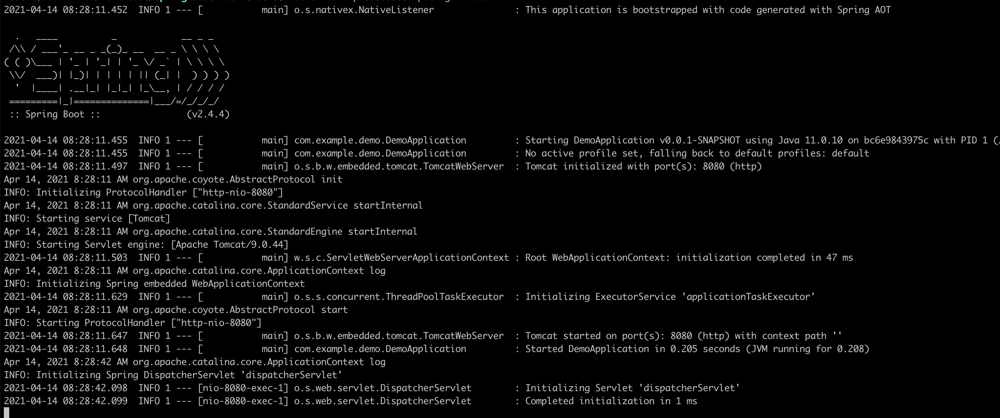

# Spring Native Demo

Spring Native 可以构建可以通过 GraalVM 将 Spring 应用程序编译成原生镜像，提供了一种新的方式来部署 Spring 应用。

Spring Native 的目标是寻找 Spring JVM 的替代方案，提供一个能将应用程序打包，并运行在轻量级容器中的方案。期望能够在 Spring Native 中支持所有的 Spring 应用程序（几乎不用修改代码）。

## 优点

* 编译出来的原生 Spring 应用可以作为一个独立的可执行文件进行部署（不需要安装 JVM）
* 几乎瞬时的启动（一般小于 100 毫秒）
* 瞬时的峰值性能
* 更低的资源消耗

## 如何构建

构建`sc-B`:
```shell
pushd sc-B
bash -x build.sh
popd
```

这样就得到了`sc-b:0.0.1-SNAPSHOT`镜像，可以直接运行了：
```shell
docker run -p 20002:20002 sc-b:0.0.1-SNAPSHOT
```
启动时间 53ms :


可以访问接口验证下：
```shell
/ # curl localhost:20002/
{"timestamp":"2021-09-13T07:42:27.679+00:00","status":404,"error":"Not Found","path":"/"}
/ # curl localhost:20002/b
B[127.0.0.1]
/ # curl localhost:20002/b-get-zone
B[cn-zhangjiakou-c]
```

当然，您可以通过Kubernetes方式来部署最终的镜像。
